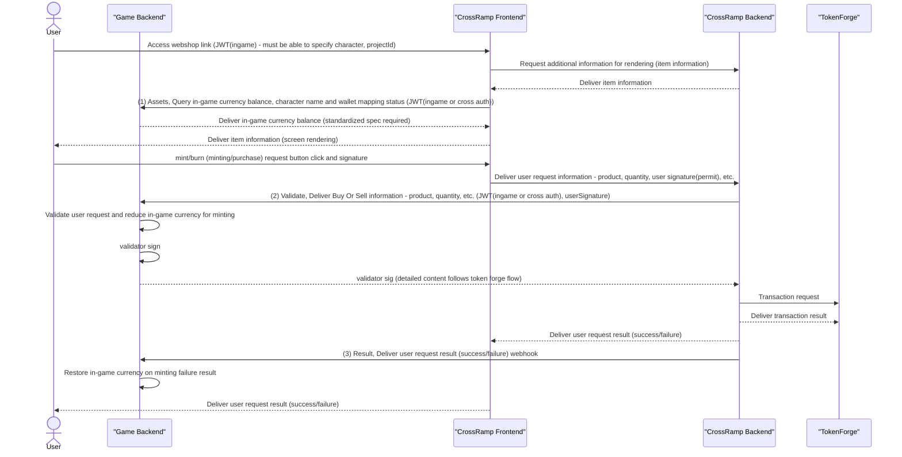

# CrossRamp Integration Guide

## Table of Contents
1. [Overview](#overview)
2. [Prerequisites](#prerequisites)
3. [Implementation Interfaces](#implementation-interfaces)
4. [HMAC-Signature](#hmac-signature)

## Overview

CrossRamp is a platform that enables easy implementation of exchanges between in-game currencies and tokens without requiring separate understanding of blockchain technology. This manual provides a step-by-step guide for onboarding developers to quickly and efficiently implement CrossRamp.

CrossRamp can be implemented in two ways:

- **UI Integration Version**: Complete integrated solution including UI and backend
- **API Only Version**: Backend API-only approach (in development)

### Demo
- **[Pong Game - CROSS RAMP Demo](https://ramp.crosstoken.io/demo)**: Click [CROSS RAMP] in the top right after accessing

### CrossRamp Overall Flow



## Prerequisites

### UI Integration Version

#### Item Registration
Until developer console support is available, share item information with Nexus using the form below, and Nexus will register the information.

**Form Download**: [Item Registration Form](https://docs.google.com/spreadsheets/d/13gJN6Sm6qlXnZqY_XB6hSWP7oU211qKmzNB-xW8ChrA/edit?gid=598496287#gid=598496287)
)

#### Access Link Example
```
https://ramp.crosstoken.io/catalog?projectId=nexus-ramp-v1&sessionId=demo-session-1754029744441&accessToken=demo-access-1754029744441&lang=zh&platform=web&timestamp=1754029746
```

#### UI Parameter Description

| Parameter | Description | Required |
|-----------|-------------|----------|
| projectId | Project ID issued by Nexus | Required |
| sessionId | Unique ID that can identify character | Required |
| accessToken | In-game user authentication token | Required |
| network | mainnet,testnet distinction (mainnet if omitted) | Optional |
| lang | Language selection (zh, en, zh-Hant) | Optional |
| platform | web | Optional |

#### Game Server Implementation Requirements

| Item | Description | Notes |
|------|-------------|-------|
| **hmac key** | X-HMAC-SIGNATURE verification key used for mutual trust between ramp backend and game backend for API requests and responses | Provided by Nexus, stored by both Nexus and game company<br>Future generation and replacement possible through developer console |
| **validator key** | When validation API receives order information verification request to game server, sign with this key after validation if order is normal | Key stored by game company, Nexus only stores public key<br>Future generation and replacement possible through developer console |
| **Assets Query API** | Used for user's in-game asset query in Ramp UI | API(v1) |
| **Validate API** | Used for user order validation in Ramp UI | API |
| **Result API** | On-chain result transmission processing | API |
| **CORS** | CORS registration required for https://ramp.crosstoken.io site | - |

### API Only Version
Currently in development.

## Implementation Interfaces

Please refer to the sample code by language at the link below:
- **GitHub**: https://github.com/to-nexus/cross-ramp-integration-sample

### Game Asset Query API

API for displaying in-game currencies on CrossRamp page.

- Provide in-game currencies for characters identifiable by DAPP_ACCESS_TOKEN and DAPP_SESSION_ID
- When DAPP_ACCESS_TOKEN and DAPP_SESSION_ID are not available, provide in-game currencies mapped to sub(wallet address) in payload after CROSS_AUTH_JWT verification (implementation planned)

#### Request Example

```bash
curl -X GET "https://api.yourgame.com/assets?language=ko" \
  -H "Authorization: Bearer <CROSS_AUTH_JWT>" \
  -H "X-Dapp-Authorization: Bearer <DAPP_ACCESS_TOKEN>" \
  -H "X-Dapp-SessionID: <DAPP_SESSION_ID>"
```

#### Response Example (v1)

```json
{
  "success": true,
  "errorCode": null,
  "data": {
    "v1": {
      "player_id": "C1",
      "name": "CharacterName01",
      "wallet_address": "0xaaaa",
      "server": "",
      "assets": [
        {
          "id": "1",
          "balance": "2000"
        }
      ]
    }
  }
}
```

#### Response Example (v2, to be provided)

```json
{
  "success": true,
  "errorCode": null,
  "data": {
    "v2": {
      "common": [
        {
          "id": "0x9",
          "balance": "19999"
        }
      ],
      "characters": [
        {
          "character_id": "C1",
          "name": "CharacterName01",
          "image_url": "CharacterImagePath",
          "wallet_account": "0xaaaa",
          "server": "",
          "inventory": [
            {
              "id": "0x1",
              "balance": "2000"
            }
          ]
        }
      ]
    }
  }
}
```

### Validation API

Validates user's in-game currency ↔ token exchange requests.

#### Request Example

```bash
curl -X POST "https://api.yourgame.com/validate" \
  -H "Content-Type: application/json" \
  -H "Authorization: Bearer <CROSS_AUTH_JWT>" \
  -H "X-HMAC-SIGNATURE: <HMAC_SIGNATURE>" \
  -H "X-Dapp-Authorization: Bearer <DAPP_ACCESS_TOKEN>" \
  -H "X-Dapp-SessionID: <DAPP_SESSION_ID>" \
  -d '{
    "user_sig": "0xabcdef",
    "user_address": "0xB777C937fa1afC99606aFa85c5b83cFe7f82BabD",
    "project_id": "acjviwejsi",
    "digest": "0x123456789...",
    "uuid": "c8ab8d7b-3fe7-....",
    "intent": {
      "method": "mint",
      "from": [{ "type": "erc20", "id": "0x1234", "amount": 1000 }],
      "to": [{ "type": "asset", "id": "ITEM01", "amount": 1000 }]
    }
  }'
```

#### Response Example

```json
{
  "success": true,
  "errorCode": null,
  "data": {
    "userSig": "0xabcdef",
    "validatorSig": "0xabcdef"
  }
}
```

### Exchange Result Delivery API

API for receiving exchange results between game assets and tokens.

#### Request Example

```bash
curl -X POST "https://api.yourgame.com/result" \
  -H "X-HMAC-SIGNATURE: <HMAC_SIGNATURE>" \
  -d '{
    "session_id": "<DAPP_SESSION_ID>",
    "uuid": "4fec342b-8ad7-4e...",
    "tx_hash": "0x123456789.....",
    "receipt": {},
    "intent": {
      "method": "mint",
      "from": [{ "type": "erc20", "id": "0x1234", "amount": 1000 }],
      "to": [{ "type": "asset", "id": "ITEM01", "amount": 1000 }]
    }
  }'
```

#### Response Example

```json
{
  "success": true,
  "errorCode": null,
  "data": null
}
```

## HMAC-Signature

For security requests requiring mutual trust, HMAC is used and signature values are required in the header with the `X-HMAC-SIGNATURE` key.

Below are examples for generating signatures by language.

### Golang

```go
package router

import (
	"crypto/hmac"
	"crypto/sha256"
	"encoding/hex"
	"encoding/json"
	"testing"
	"github.com/stretchr/testify/require"
)

const (
	salt = "my_secret_salt_value_!@#$%^&*" // hmac key
)

type Body struct {
	UserID    int    `json:"userId"`
	Username  string `json:"username"`
	Email     string `json:"email"`
	Role      string `json:"role"`
	CreatedAt int    `json:"createdAt"`
}

var (
	body = Body{
		UserID:    1234,
		Username:  "홍길동",
		Email:     "user@example.com",
		Role:      "admin",
		CreatedAt: 1234567890,
	}
)

func TestSha256(t *testing.T) {
	bodyBytes, err := json.Marshal(body)
	require.NoError(t, err)
	t.Log(string(bodyBytes))
	
	hmac := hmac.New(sha256.New, []byte(salt))
	hmac.Write(bodyBytes)
	hashBytes := hmac.Sum(nil)
	hashString := hex.EncodeToString(hashBytes)
	t.Log("hashString", hashString) 
	// expected X-HMAC-Signature: f96cf60394f6b8ad3c6de2d5b2b1d1a540f9529082a8eb9cee405bfbdd9f37a1
}
```

### Javascript

```javascript
const crypto = require('crypto');

function hmacSha256(data, salt) {
    return crypto.createHmac('sha256', salt).update(data).digest('hex');
}

// Define JSON object request body
const requestBody = {
    userId: 1234,
    username: '홍길동',
    email: 'user@example.com',
    role: 'admin',
    createdAt: 1234567890,
};

const salt = 'my_secret_salt_value_!@#$%^&*'; // hmac key
const jsonString = JSON.stringify(requestBody);

console.log('JSON string:', jsonString);
// Output result
console.log('HMAC-SHA256:', hmacSha256(jsonString, salt)); 
// expected X-HMAC-Signature: f96cf60394f6b8ad3c6de2d5b2b1d1a540f9529082a8eb9cee405bfbdd9f37a1
``` 


## Summary

- In-game user accessToken and sessionId for character identification are required.
- ERC20 and in-game asset conversion rules and game resources should be shared using the [Item Registration Form](https://docs.google.com/spreadsheets/d/13gJN6Sm6qlXnZqY_XB6hSWP7oU211qKmzNB-xW8ChrA/edit?gid=598496287#gid=598496287).
- Implementation of in-game asset query, user order validation, and on-chain result processing APIs is required.
(Please refer to the language-specific sample code in this repository.)
