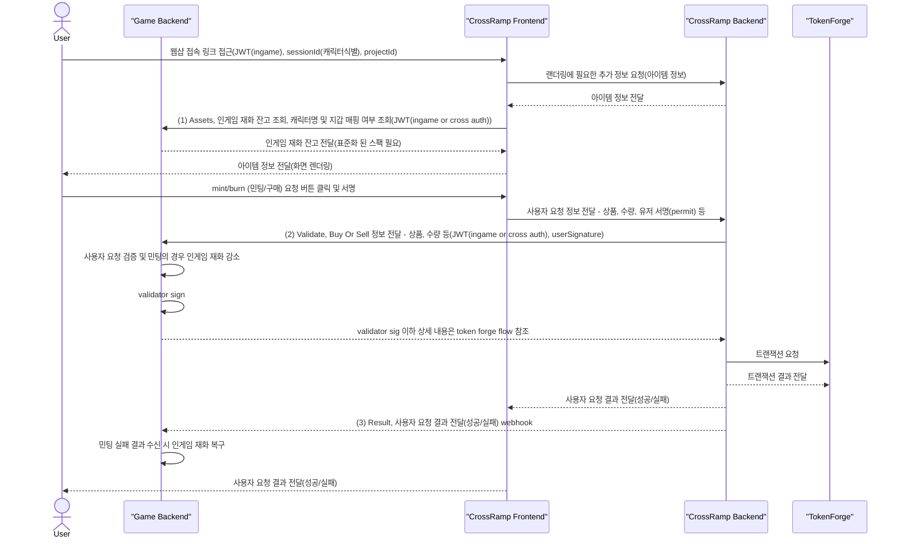

# CrossRamp 통합 가이드

## 개요

CrossRamp는 블록체인 기술에 대한 별도의 이해 없이도 인게임 재화와 토큰 간의 교환을 손쉽게 구현할 수 있도록 지원하는 플랫폼입니다. 본 매뉴얼은 온보딩 개발사가 CrossRamp를 빠르고 효율적으로 적용할 수 있도록 단계별 가이드를 제공합니다.

CrossRamp는 다음 두 가지 방식으로 적용할 수 있습니다:

- **UI 통합 버전**: UI와 백엔드를 모두 포함한 통합 솔루션
- **API Only 버전**: 백엔드 API만을 활용하는 방식 (준비중)

### 데모
- [**Pong Game - CROSS RAMP Demo**](https://ramp.crosstoken.io/demo): 접속 후 우측 상단 [CROSS RAMP] 클릭

### CrossRamp Sequence Diagram



## 준비 사항

### UI 통합 버전

#### 아이템 등록
Developer console 지원 전까지 아래 양식으로 아이템 정보를 넥써쓰에 공유, 넥써쓰에서 정보 등록

**양식 다운로드**: [아이템 등록 양식](https://docs.google.com/spreadsheets/d/13gJN6Sm6qlXnZqY_XB6hSWP7oU211qKmzNB-xW8ChrA/edit?gid=598496287#gid=598496287)

#### 접속 링크 예시
```
https://ramp.crosstoken.io/catalog?projectId=nexus-ramp-v1&sessionId=demo-session-1754029744441&accessToken=demo-access-1754029744441&lang=zh&platform=web&timestamp=1754029746
```

#### UI 파라미터 설명

| 파라미터명 | 설명 | 필수여부 |
|-----------|------|----------|
| projectId | 넥써쓰에서 발급하는 Project ID | 필수 |
| sessionId | 캐릭터 식별 가능한 유니크 아이디 | 필수 |
| accessToken | 인게임 유저 인증 토큰 | 필수 |
| network | mainnet,testnet 구분(생략 시 mainnet) | 선택 |
| lang | 언어 선택 (zh, en, zh-Hant) | 선택 |
| platform | web | 선택 |

#### 게임서버 구현 사항 설명

| 항목 | 설명 | 비고 |
|------|------|------|
| **hmac key** | Ramp 백엔드와 게임 백엔드 간의 API 요청 및 응답에 상호 신뢰를 위해 사용되는 X-HMAC-SIGNATURE 검증 키 | 넥써쓰에서 제공 예정이고 넥써쓰, 게임사 양측 모두 보관<br>향후 developer console에서 생성,교체 가능 |
| **validator key** | 검증 API로 게임사 서버에 주문 정보 검증 요청이 들어오는 경우, 검증 후 정상 주문일 경우 해당 키로 서명 | 키는 게임사에 보관되고 넥써쓰는 퍼블릭 키만 보관<br>향후 developer console에서 생성,교체 가능 |
| **Assets 조회 API** | Ramp UI에서 유저의 인게임 자산 조회에 사용 | API(v1) |
| **Validate API** | Ramp UI에서 유저의 주문 검증에 사용 | API |
| **Result API** | 온체인 결과 송신 처리 | API |
| **CORS** | https://ramp.crosstoken.io 사이트에 대한 CORS 등록 필요 | - |

### API Only 버전
준비 중입니다.

## 구현 인터페이스

언어별 샘플 코드는 아래 링크에서 참고 부탁드립니다:
- **GitHub**: https://github.com/to-nexus/cross-ramp-integration-sample

### Game Asset 조회 API

인게임 재화를 CrossRamp 페이지에 표시하기 위한 API입니다.

- DAPP_ACCESS_TOKEN 및 DAPP_SESSION_ID로 식별 가능한 캐릭터의 인게임 재화 제공
- DAPP_ACCESS_TOKEN 및 DAPP_SESSION_ID가 없을 경우 CROSS_AUTH_JWT 검증 후 payload의 sub(지갑주소)로 매핑된 인게임 재화 제공 (구현 예정)

#### Request 예시

```bash
curl -X GET "https://api.yourgame.com/assets?language=ko" \
  -H "Authorization: Bearer <CROSS_AUTH_JWT>" \
  -H "X-Dapp-Authorization: Bearer <DAPP_ACCESS_TOKEN>" \
  -H "X-Dapp-SessionID: <DAPP_SESSION_ID>"
```

#### Response 예시 (v1)

```json
{
  "success": true,
  "errorCode": null,
  "data": {
    "v1": {
      "player_id": "C1",
      "name": "캐릭터이름01",
      "wallet_address": "0xaaaa",
      "server": "",
      "assets": [
        {
          "id": "1",
          "balance": "2000"
        }
      ]
    }
  }
}
```

#### Response 예시 (v2, 추후 제공)

```json
{
  "success": true,
  "errorCode": null,
  "data": {
    "v2": {
      "common": [
        {
          "id": "0x9",
          "balance": "19999"
        }
      ],
      "characters": [
        {
          "character_id": "C1",
          "name": "캐릭터이름01",
          "image_url": "캐릭터이미지경로",
          "wallet_account": "0xaaaa",
          "server": "",
          "inventory": [
            {
              "id": "0x1",
              "balance": "2000"
            }
          ]
        }
      ]
    }
  }
}
```

### 검증 API

- 유저의 인게임 재화 ↔ 토큰 교환 요청을 검증합니다.
- intent type이 assemble 일 경우 인게임 재화를 차감 합니다.
- uuid에 대한 중복 요청이 있을 경우 차단 합니다.
- 게임사에서 별도로 정한 규칙에 위배 된다면 차단 합니다.
- disassemble의 경우에도 게임사에서 별도로 정한 규칙에 위배 된다면 차단 합니다.(인게임 재화의 일일 발행량 제한, 캐릭터별 구매 제한 등)

#### Request 예시

```bash
curl -X POST "https://api.yourgame.com/validate" \
  -H "Content-Type: application/json" \
  -H "Authorization: Bearer <CROSS_AUTH_JWT>" \
  -H "X-HMAC-SIGNATURE: <HMAC_SIGNATURE>" \
  -H "X-Dapp-Authorization: Bearer <DAPP_ACCESS_TOKEN>" \
  -H "X-Dapp-SessionID: <DAPP_SESSION_ID>" \
  -d '{
    "user_sig": "0xabcdef",
    "user_address": "0xB777C937fa1afC99606aFa85c5b83cFe7f82BabD",
    "project_id": "acjviwejsi",
    "digest": "0x123456789...",
    "uuid": "c8ab8d7b-3fe7-....",
    "intent": {
      "type": "assemble", // assemble || disassamble
      "method": "mint",
      "from": [{ "type": "erc20", "id": "0x1234", "amount": 1000 }],
      "to": [{ "type": "asset", "id": "ITEM01", "amount": 1000 }]
    }
  }'
```

#### Response 예시

```json
{
  "success": true,
  "errorCode": null,
  "data": {
    "userSig": "0xabcdef",
    "validatorSig": "0xabcdef"
  }
}
```

### 교환 결과 전달 API

- 게임 자산과 토큰 간 교환 결과를 전달받는 API입니다.
- receipt.status가 0x1 이 아닌 경우 온체인에서 실패 입니다. (assemble일 경우 인게임 자산 환불 필요)
- disassamble일 경우 인게임 재화를 캐릭터에 지급 합니다.
- uuid 로 주문을 식별하여 중복 처리를 방지 합니다.

#### Request 예시

```bash
curl -X POST "https://api.yourgame.com/result" \
  -H "X-HMAC-SIGNATURE: <HMAC_SIGNATURE>" \
  -d '{
    "session_id": "<DAPP_SESSION_ID>",
    "uuid": "4fec342b-8ad7-4e...",
    "tx_hash": "0x123456789.....",
    "receipt": {
      "status" : 0x1,
      ...
    },
    "intent": {
      "type": "assemble", // assemble || disassamble
      "method": "mint",
      "from": [{ "type": "asset", "id": "material_01", "amount": 1000 }],
      "to": [{ "type": "asset", "id": "ITEM01", "amount": 1000 }]
    }
  }'
```

#### Response 예시

```json
{
  "success": true,
  "errorCode": null,
  "data": null
}
```

## HMAC-Signature

상호 요청에 대한 신뢰를 위해 보안 요청이 필요한 경우 HMAC을 사용하고 헤더에 `X-HMAC-SIGNATURE` 키로 서명 값을 요구합니다.

아래는 Language별 signature 생성을 위한 예시입니다.

### Golang

```go
package router

import (
	"crypto/hmac"
	"crypto/sha256"
	"encoding/hex"
	"encoding/json"
	"testing"
	"github.com/stretchr/testify/require"
)

const (
	salt = "my_secret_salt_value_!@#$%^&*" // hmac key
)

type Body struct {
	UserID    int    `json:"userId"`
	Username  string `json:"username"`
	Email     string `json:"email"`
	Role      string `json:"role"`
	CreatedAt int    `json:"createdAt"`
}

var (
	body = Body{
		UserID:    1234,
		Username:  "홍길동",
		Email:     "user@example.com",
		Role:      "admin",
		CreatedAt: 1234567890,
	}
)

func TestSha256(t *testing.T) {
	bodyBytes, err := json.Marshal(body)
	require.NoError(t, err)
	t.Log(string(bodyBytes))
	
	hmac := hmac.New(sha256.New, []byte(salt))
	hmac.Write(bodyBytes)
	hashBytes := hmac.Sum(nil)
	hashString := hex.EncodeToString(hashBytes)
	t.Log("hashString", hashString) 
	// expected X-HMAC-Signature: f96cf60394f6b8ad3c6de2d5b2b1d1a540f9529082a8eb9cee405bfbdd9f37a1
}
```

### Javascript

```javascript
const crypto = require('crypto');

function hmacSha256(data, salt) {
    return crypto.createHmac('sha256', salt).update(data).digest('hex');
}

// JSON 객체 정의 request body
const requestBody = {
    userId: 1234,
    username: '홍길동',
    email: 'user@example.com',
    role: 'admin',
    createdAt: 1234567890,
};

const salt = 'my_secret_salt_value_!@#$%^&*'; // hmac key
const jsonString = JSON.stringify(requestBody);

console.log('JSON 문자열:', jsonString);
// 결과 출력
console.log('HMAC-SHA256:', hmacSha256(jsonString, salt)); 
// expected X-HMAC-Signature: f96cf60394f6b8ad3c6de2d5b2b1d1a540f9529082a8eb9cee405bfbdd9f37a1
```

## 요약

- 인게임 유저 accessToken, 캐릭터 식별을 위한 sessionId가 필요 합니다.
- ERC20과 인게임 자산 변환 규칙 및 게임 리소스를 [아이템 등록 양식](https://docs.google.com/spreadsheets/d/13gJN6Sm6qlXnZqY_XB6hSWP7oU211qKmzNB-xW8ChrA/edit?gid=598496287#gid=598496287)을 다운받아 공유 부탁드립니다.
- 인게임 자산 조회, 유저 주문 검증, 온체인 결과 처리 API 구현이 필요 합니다.
(해당 레포지토리의 언어별 샘플 코드를 참고 부탁드립니다.)

---

## 최근 업데이트

**v1.1.0 (2024-12-28)**
- UI 파라미터 설명에 network 파라미터 추가
- 가이드와 샘플 코드 간 ExchangeIntent 구조 불일치 수정
- 모든 언어에 ValidateIntent 및 ExchangeIntent type 필드 추가
